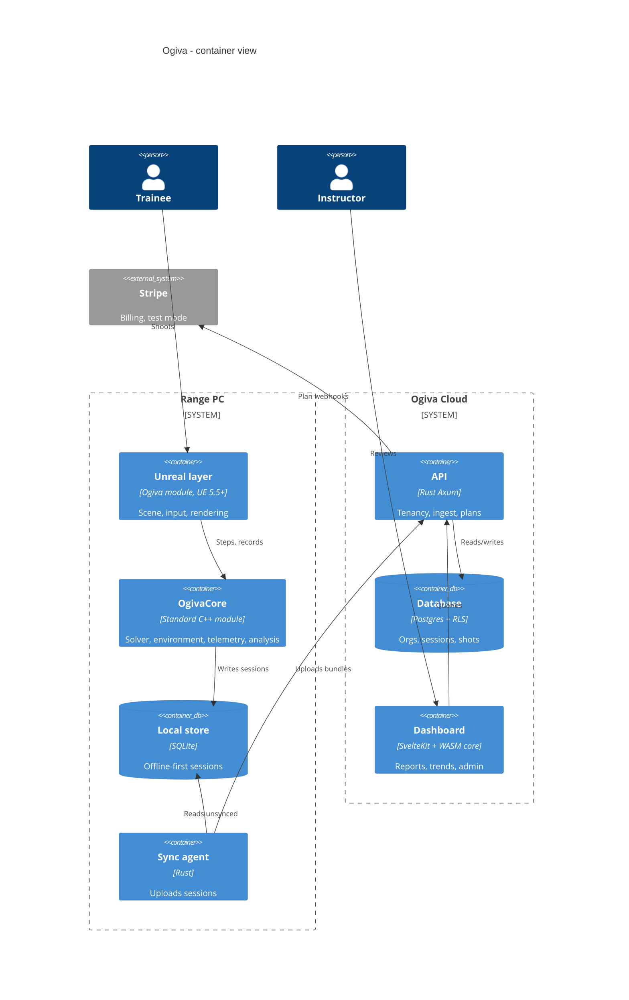

# PRD: Ogiva

Sep 29, 2026 · Felipe Carvajal Brown

## Summary

Ogiva is a ballistics and shooting-analytics plugin for Unreal Engine 5.5 and later. It computes physically grounded projectile trajectories, records per-shot telemetry, and turns that telemetry into trainer-grade analysis.

The flagship demo is a virtual range in Unreal Engine plus a subscription dashboard (Rust Axum + Postgres + SvelteKit). The dashboard runs the same C++ analysis lib compiled to WebAssembly. The pitch: training-sim vendors today ship CSV exports; Ogiva ships validated physics, structured telemetry and a dashboard a customer pays for monthly.

## Goals and non-goals

**Goals**

- One Unreal Engine plugin for UE 5.5 and later, with the solver and analysis in a portable standard-C++ module that also compiles to WASM for the dashboard.
- Deterministic results: same inputs + seed = same trajectory and same stats on every platform, including WASM.
- Validated physics: drop and drift tables within a stated tolerance of published reference data.
- Telemetry and analysis as first-class outputs, not an afterthought CSV.
- A working multi-tenant SaaS demo that shows the business model.

**Non-goals**

- Authoring armor-defeat physics. Ogiva scores hits on armored zones and applies the outcome from a customer-supplied, certified protection table; it ships no penetration equations or real-world armor data of its own.
- Hardware integration (laser rifles, projectors, recoil kits) in v1. The API leaves room for it.
- Real payments. Billing runs in Stripe test mode only.
- Photoreal art. The demo range uses stock or blockout assets.

## Users and use cases

| User | Needs | Ogiva gives |
| --- | --- | --- |
| Training-sim vendor (e.g. a virtual range company) | Credible physics, reports customers pay for | Core + telemetry + dashboard as a white-label base |
| Instructor | Know why a trainee misses, track progress | Bias vs dispersion split, trace metrics, sight corrections, trends |
| Trainee | Clear feedback after each string | Session replay, shot plot, one-line diagnosis |
| Unreal Engine developer | Realistic bullet drop without writing a solver | Drop-in plugin, Blueprint nodes, projectile presets |
| Org admin | Seats, plans, data per unit | Multi-tenant orgs, roles, plan tiers |

## Architecture

One Unreal Engine plugin with two modules: `OgivaCore`, standard C++ only, holding the solver, environment, telemetry and analysis; and `Ogiva`, the Unreal layer (subsystem, DataAssets, Blueprint nodes, debug draw, replay) that depends on it. The same `OgivaCore` sources run in the sim and, compiled to WASM, in the dashboard (ADR 0002, ADR 0005).



**Dependency rule:** arrows point inward. `OgivaCore` includes no engine, network or UI headers; the Unreal layer, agent and backend depend on its telemetry schema, never the reverse.

**Repository layout:**

```text
ogiva/
├── plugin/Ogiva/                 # the product, UE 5.5+
│   ├── Ogiva.uplugin
│   └── Source/
│       ├── OgivaCore/            # standard C++ only, no engine headers
│       │   ├── Public/  Private/ # ballistics, environment, projectiles,
│       │   │                     # impact, telemetry, analysis
│       │   ├── OgivaCore.Build.cs
│       │   └── CMakeLists.txt    # side build: native tests + WASM
│       └── Ogiva/                # Unreal layer: subsystem, DataAssets, Blueprint nodes
├── tests/core/                   # Catch2, reference tables, golden files
├── demo/OgivaRange/              # range demo; loads the plugin via AdditionalPluginDirectories
├── sync-agent/           # Rust
├── backend/              # Rust Axum + sqlx, migrations/
├── dashboard/            # SvelteKit, pnpm
└── docs/                 # PRD, C4, ADRs, error-analysis report
```

## Ballistics core

A 3-DOF point-mass model in SI units, integrated independently of any frame rate. Velocity relative to air is v_r = v − w, and Mach is M = |v_r| / c.

```latex
\frac{d\mathbf{v}}{dt} = -\frac{\rho \, \pi d^2 \, i \, C_{d,\mathrm{ref}}(M)}{8m} \, |\mathbf{v}_r| \, \mathbf{v}_r \; + \; \mathbf{g} \; - \; 2\,\boldsymbol{\Omega} \times \mathbf{v}
```

Here i is the form factor derived from the ballistic coefficient against the chosen reference (G1 or G7), and Ω is Earth's rotation vector at the shooter's latitude.

**Integrators** (behind one `Integrator` interface, so they can be benchmarked against each other):

1. Explicit Euler, as the baseline everyone else uses.
2. RK4 at fixed dt, the default for real-time.
3. Dormand–Prince RK45 with adaptive step, used as the reference and for offline tables.

**Event detection:** the crossing of the target plane is found by dense-output (Hermite) interpolation between steps, not by the step that overshoots. This is where naive sims lose accuracy.

**Zeroing:** solve for the launch angle θ so the path crosses the line of sight at the zero range, with the secant method on f(θ) = y(x_zero; θ) − y_sight. Then solve holdover and windage for any range from the zeroed state.

**Corrections applied after the point-mass solve:**

- Spin drift, Litz approximation: 1.25 · (Sg + 1.2) · t^1.83 inches, with t = time of flight in seconds.
- Aerodynamic jump from crosswind, as a vertical offset scaled by Sg.

**Deliverable:** an error-analysis report comparing Euler, RK4 and RK45 (error vs dt, cost vs accuracy) against the RK45 reference at tight tolerance.

## Calibers and environment

**Projectile profile** (JSON in the core, mirrored as a `UDataAsset` in UE):

| Field | Unit | Used for |
| --- | --- | --- |
| mass | kg | drag deceleration, Sg |
| diameter, length | m | reference area, Sg |
| bc, drag_model | G1 or G7 | form factor i |
| muzzle_velocity | m/s | initial state |
| mv_temp_coeff | m/s per °C | powder temperature sensitivity |
| twist_rate | m per turn, R/L | Sg, spin drift direction |
| mv_sd, bc_sd | m/s, fraction | Monte Carlo dispersion |

**Drag table:** C_d,ref(M) comes from the G1/G7 reference tables, interpolated with PCHIP. PCHIP is monotone, so it does not overshoot around the transonic knee the way a cubic spline does.

**Gyroscopic stability, Miller formula** (m in grains, d in inches, t and l in calibers), with velocity and air-density corrections:

```latex
S_g = \frac{30\,m}{t^2 d^3 l\,(1 + l^2)} \cdot \left(\frac{v}{2800}\right)^{1/3} \cdot \frac{T + 460}{519} \cdot \frac{29.92}{P}
```

**Environment model:**

- Air density from station pressure, temperature and humidity. Vapor pressure uses the Buck equation; density is the dry-air plus water-vapor partial-pressure sum.
- Speed of sound from temperature, c = √(γ R T), because Mach indexes the drag table.
- Wind as a field sampled along the path, per range segment, not one constant vector.
- Gusts from an Ornstein–Uhlenbeck process: mean-reverting noise with a set time constant and σ. It is seeded, so a replay reproduces every gust.
- Latitude and firing azimuth feed the Coriolis term.
- Presets: ISA sea level, hot/humid, high altitude (e.g. a range in the Andes foothills), plus custom.

## Targets, hit zones and armor

Every hit is scored against a zone, including hits on armored zones of targets and of trainees' own protective gear in force-on-force drills.

- **Hit-zone map:** any hittable entity (paper or steel target, 3D mannequin, trainee avatar) carries named zones, each tagged with a protection profile id or "unprotected". The host's raycast callback returns the zone id.
- **Impact kinematics from the core:** impact point, velocity, energy and obliquity (angle to the surface normal) for every hit.
- **ImpactResolver interface:** decides the outcome per hit. The default resolver is a lookup table (protection profile × projectile profile → stopped / not stopped, or a probability), supplied, signed and versioned by the customer. Ogiva owns the plumbing, not the armor data.
- **Accounting:** hits on armor vs exposed zones per trainee, zone heatmaps, and friendly (blue-on-blue) hits counted separately.
- **Training feedback:** in force-on-force, repeated hits on exposed zones point to posture and cover problems, reported in the dashboard.
- **Audit trail:** every resolved hit records the resolver table version, so any result can be traced to the data that produced it.

**Adversary scenarios:** instructors author scenarios where adversary avatars wear a protection profile per zone. Exposed-zone hits register directly; armored-zone hits go through the resolver. Trainees are scored on shot placement against armored and unarmored threats.

**Demo data:** the portfolio build ships a clearly fictional table ("Protection A/B/C" × demo projectile presets), labeled demo-only. Real deployments load the customer's certified test data through the same interface.

## Telemetry

Every session is a self-describing, versioned record: session → strings → shots → traces. Game code never touches the storage format; it calls the recorder through the `Ogiva` module and `OgivaCore` does the rest.

| Record | Key fields |
| --- | --- |
| Session | id, org, trainee, instructor, projectile profile, environment preset, seed, schema version, SDK version |
| Shot | timestamp, aim point, break point, environment snapshot, TOF, impact velocity, drop, drift, impact xy on target, zone id, obliquity, resolver outcome and table version, score |
| Aim trace | fixed-rate samples (default 120 Hz) of aim xy for the 2 s before the break and 0.5 s after (follow-through) |
| Event | string start/end, target change, re-zero, pause |

**Recorder:**

- Lock-free single-producer ring buffer on the game/host thread; a worker thread drains it to a local SQLite file.
- The host thread never blocks on I/O; buffer overflow is counted and reported, never silent.
- Offline-first: the SQLite file is the source of truth until the sync agent confirms upload.
- Exports: JSON (full fidelity), CSV (compatibility), and the upload payload for the backend.

## Analysis

The analysis lib answers the instructor's real question: is the miss the shooter, the sights, or the rifle and ammo? It is pure C++, and the same build runs in the sim and, as WASM, in the dashboard.

**Group statistics** (per string, angular units so ranges compare):

- Mean point of impact (MPI) = accuracy/bias; dispersion around it = precision.
- Extreme spread, mean radius, radial SD.
- CEP from a Rayleigh fit: CEP = σ √(2 ln 2) ≈ 1.1774 σ.
- Confidence interval on σ, because 5 to 10 shots say little on their own. With k = 2(n − 1) degrees of freedom:

```latex
\sqrt{\frac{k\,\hat\sigma^2}{\chi^2_{1-\alpha/2,\,k}}} \;\le\; \sigma \;\le\; \sqrt{\frac{k\,\hat\sigma^2}{\chi^2_{\alpha/2,\,k}}}
```

**Sight correction:** MPI offset converted to clicks (MIL or MOA per click), only recommended when a Hotelling T² test says the offset is significant:

```latex
T^2 = n\,\bar{\mathbf{x}}^{\mathsf T} S^{-1} \bar{\mathbf{x}}, \qquad \frac{n-2}{2(n-1)}\,T^2 \sim F_{2,\,n-2}
```

**Aim-trace metrics** (from the pre-break window):

- Path length and jitter RMS over the last 1 s.
- Percent of time inside the scoring zone.
- Drift vector in the last 150 ms (trigger jerk shows here).
- Follow-through movement after the break.

**Monte Carlo expected group:** sample MV, BC and wind from their SDs, fly N trajectories, get the equipment-only dispersion. Observed dispersion minus expected (in quadrature) estimates shooter error.

**Trends:** per-trainee series of σ, MPI distance and trace metrics across sessions, with a simple regression slope to flag improvement or regression.

## Unreal layer and plugin API

`OgivaCore` knows nothing about Unreal. The `Ogiva` module is the only code that touches both: it converts units and axes, forwards Unreal's ray casts into `OgivaCore`, and draws results.

**Callback contract** (what the `Ogiva` module supplies to `OgivaCore`):

- `raycast(from, to) -> hit {point, normal, material_id, zone_id}`, so impacts use the engine's own collision.
- `material_props(material_id) -> {ricochet_angle, restitution}`.
- Optional `on_impact`, `on_shot_recorded` callbacks for FX and UI.

**Coordinate and unit rules:** `OgivaCore` is SI, right-handed, Z-up. The `Ogiva` module owns the conversion to Unreal (centimeters, left-handed, Z-up), in one place, tested by UE Automation tests, never scattered across game code.

| Target | Form | Priority |
| --- | --- | --- |
| Unreal Engine 5.5 and later | Plugin: `UOgivaSubsystem` (WorldSubsystem), `UProjectileProfile` DataAsset, Blueprint nodes, debug trajectory draw, replay | v1 |
| WebAssembly | Emscripten build of `OgivaCore` analysis (+ solver) for the dashboard, from the side CMake build | v1 |

**Batch mode:** `OgivaCore` accepts arrays of projectiles in SoA layout and steps them together, so a scene with thousands of rounds in flight makes one call per tick, not one per bullet.

**Versioning:** semantic versioning on the plugin; every telemetry record carries the SDK and schema version.

## SaaS dashboard demo

The dashboard is what a customer pays for monthly; the CSV becomes one export button inside it.

**Backend: Rust, Axum + Postgres (sqlx)**

- Tenancy: organization → units → instructors and trainees → sessions. Postgres row-level security keyed on `org_id`, so a tenant leak needs two bugs, not one.
- Auth: email + password and magic link; roles owner, admin, instructor, trainee.
- Ingest: the sync agent posts signed, idempotent session bundles; server re-validates schema version.
- Billing: Stripe test mode, webhooks set the org's plan; plan limits enforced in middleware.

**Sync agent: Rust**, runs next to the sim, uploads SQLite sessions when online, retries with backoff, marks rows as synced only after a server ack.

**Frontend: SvelteKit (pnpm)**, loads the Ogiva WASM module so every stat on screen is computed by the same code as the sim.

- Trainee view: shot plot, aim-trace replay, group stats with confidence intervals, suggested correction.
- Instructor view: squad table, who is improving or regressing, zone heatmaps, filters by caliber and conditions.
- Admin view: seats, plan, usage, exports (PDF report, JSON, CSV).

| Plan | Includes |
| --- | --- |
| Basic | Shot plots, group stats, CSV/JSON export, 1 unit |
| Pro | + aim-trace metrics, sight corrections, trends, PDF reports |
| Enterprise | + Monte Carlo equipment vs shooter split, force-on-force zone analytics, multiple units, API access |

## Worldwide readiness

The target company sells internationally, so every layer must work outside Chile from day one.

| Area | Requirement |
| --- | --- |
| Units | Core stays SI; display in metric or imperial per user; angular units MIL or MOA per optic profile; click values per optic |
| Language | Dashboard i18n from v1: Spanish, English, Portuguese; all strings in locale files, none in code |
| Formats | Dates, numbers and decimal separators per locale; timestamps stored UTC, shown in the range's time zone |
| Environment | Latitude/longitude per range drives Coriolis and default air conditions; any hemisphere |
| Data residency | Region-pinned tenants (e.g. EU, Americas); GDPR and Chile's personal-data law as the design baseline |
| Billing | Stripe multi-currency prices and tax handling per country (test mode in the demo) |
| Deployment | SaaS plus an on-prem / air-gapped option for defense customers, same backend image |
| Compliance | Export-control review (dual-use / defense-training software) before selling abroad; flagged as a risk, not solved by the demo |

## Validation and testing

The credibility claim rests here: every physics number is checked against something outside the codebase.

- **Reference tables:** drop, drift and TOF for a set of common projectile profiles vs published manufacturer or ballistics-calculator tables; tolerance target stated per range band (open question below).
- **Analytic checks:** vacuum case (no drag) must match the closed-form parabola to machine precision; constant-Cd case vs a high-tolerance RK45 run.
- **Convergence:** RK4 error must fall as dt⁴; the test fails if the observed order drifts.
- **Statistics:** analysis functions tested against synthetic groups drawn from a known σ and bias; CI coverage checked by simulation (≈ 95% of intervals contain true σ).
- **Resolver:** table loading, signature and version checks, zone lookup, and audit-trail completeness on every hit.
- **Determinism:** same seed → bit-identical telemetry on Linux, Windows, macOS and WASM; golden files in CI.
- **Unreal tests:** unit and axis conversions and the Blueprint layer via UE Automation tests; physics and analysis are never tested only inside Unreal.
- **CI:** side CMake build + Catch2 for `OgivaCore` (no Unreal install needed), cargo test for backend and agent, Playwright smoke test for the dashboard.

## Milestones

Each milestone ends with something demoable; the core comes first because everything else consumes it.

1. **M1 Core solver:** plugin and `OgivaCore` skeleton with the side CMake build, point-mass model, three integrators, drag tables, zeroing. Gate: vacuum and convergence tests green, first reference table within tolerance.
2. **M2 Calibers and environment:** projectile profiles, Miller Sg, spin drift, Buck density, OU wind, Coriolis. Gate: full reference set passes.
3. **M3 Impact, telemetry and analysis:** hit zones, ImpactResolver with the demo table, recorder, SQLite store, group stats, CIs, T² correction, trace metrics, Monte Carlo. Gate: synthetic-group coverage test passes.
4. **M4 Unreal layer and range demo:** subsystem, DataAssets, Blueprint nodes, debug draw, replay, one playable range with an adversary scenario. Gate: 60 fps with the solver in the loop on a mid-range PC.
5. **M5 SaaS:** WASM build, Axum backend with RLS, sync agent, SvelteKit dashboard, Stripe test billing. Gate: a session shot in UE shows up in the dashboard with identical stats.
6. **M6 Polish for the pitch:** C4 diagrams, error-analysis report, a 2-minute video walking from shot to dashboard.

## Risks and open questions

**Risks**

- Bit-identical floats across platforms are hard: FMA contraction, libm differences and WASM. Mitigation: no fast-math, FMA off, own implementations of the few transcendental functions used, golden-file CI per target.
- G1/G7 reference data licensing: use tables from public-domain sources and document provenance.
- Protection-table validity is the customer's responsibility; the engine must make the table version visible on every result.
- Scope creep toward a full product: the pitch needs M1 to M4 solid more than M5 complete.
- Two build definitions for `OgivaCore` (Build.cs for UnrealBuildTool, CMake for tests and WASM) can drift in sources or floating-point flags. Mitigation: `OgivaCore.Build.cs` sets the same determinism flags explicitly, and the M4 gate compares Unreal results against the CMake build.

**Open questions**

- [ ] Tolerance targets per range band for the reference-table test.
- [ ] Which projectile profiles to ship as presets, and from which public data.
- [ ] License: MIT/Apache for the core (portfolio visibility) vs source-available for the SaaS parts.
- [ ] Does the target company run projector ranges with laser detection? If so, a camera-calibration adapter becomes a v2 priority.
- [ ] Trademark check for "Ogiva" in target markets (WIPO Global Brand Database, INAPI, USPTO, EUIPO) and domain/crate/npm name availability before going public.
